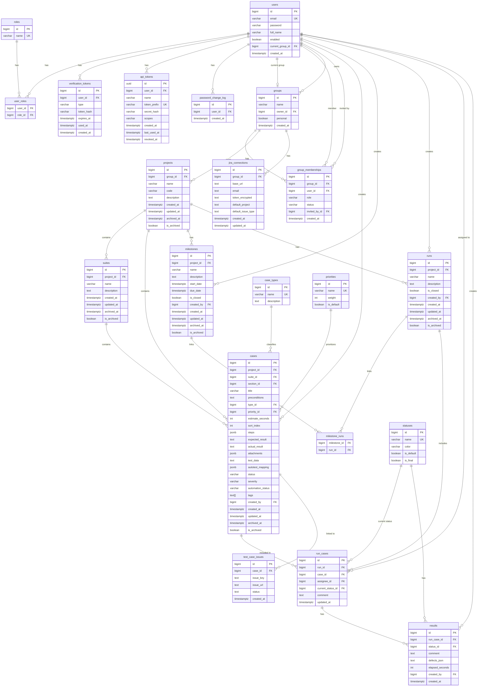

# Test Case Management System

> A comprehensive test case management platform built with Spring Boot and React

## 📋 Overview

Test Case Management System is a modern, full-featured platform for managing software testing workflows. It provides teams with tools to organize, execute, and track test cases across multiple projects with seamless collaboration features.

### Key Capabilities

- 🎯 **Test Case Management** - Create, organize, and maintain test cases with rich metadata
- 🚀 **Test Execution** - Run test sessions with real-time status tracking
- 👥 **Team Collaboration** - Multi-user workspaces with role-based access control
- 📊 **Milestone Tracking** - Organize tests by releases, sprints, or custom milestones
- 🔗 **Jira Integration** - Bi-directional sync with Jira for defect tracking
- 📈 **Reporting & Analytics** - Track test coverage, execution progress, and quality metrics
- 🔐 **Enterprise Security** - JWT authentication, API tokens, and audit logging

## 🏗️ Architecture

### Technology Stack

**Backend:**
- Java 21
- Spring Boot 3.x
- Spring Security (JWT)
- Spring Data JPA
- PostgreSQL 14+
- Flyway (Database Migrations)
- Maven

**Frontend:**
- React 18
- TypeScript
- Material-UI / Ant Design
- Redux / Context API
- Axios

**Infrastructure:**
- Docker & Docker Compose
- PostgreSQL
- Nginx (reverse proxy)

### Project Structure

```
├── src/main/java/com/test/system/
│   ├── config/          # Application configuration
│   ├── controller/      # REST API endpoints
│   ├── dto/             # Data Transfer Objects
│   ├── entity/          # JPA entities
│   ├── repository/      # Data access layer
│   ├── service/         # Business logic
│   ├── security/        # Authentication & authorization
│   └── exception/       # Exception handling
├── src/main/resources/
│   ├── db/migration/    # Flyway database migrations
│   └── application.yml  # Application configuration
└── src/test/           # Unit and integration tests
```

## 🚀 Getting Started

### Prerequisites

- Java 21 or higher
- Maven 3.8+
- PostgreSQL 14+
- Node.js 18+ (for frontend)

### Installation

1. **Clone the repository**
```bash
git clone <repository-url>
cd old-ai-assistant-client
```

2. **Configure database**
```bash
# Create PostgreSQL database
createdb testcase_db

# Update application.yml with your database credentials
```

3. **Build and run**
```bash
# Build the application
mvn clean install

# Run the application
mvn spring-boot:run
```

4. **Access the application**
- Backend API: http://localhost:8080
- API Documentation: http://localhost:8080/swagger-ui.html

## 📊 Database Schema

### Overview

The system uses PostgreSQL with a normalized schema consisting of 25 tables organized into 7 functional modules:

1. **Users & Authentication** (7 tables) - users, roles, user_roles, verification_tokens, api_tokens, password_change_log, user_preferences
2. **Groups & Memberships** (2 tables) - groups, group_memberships
3. **Projects & Test Organization** (5 tables) - projects, suites, sections, case_types, priorities
4. **Test Cases** (1 table) - cases
5. **Milestones** (2 tables) - milestones, milestone_runs
6. **Test Execution** (4 tables) - runs, run_cases, results, statuses
7. **Jira Integration** (2 tables) - jira_connections, test_case_issues

## Database Entity-Relationship Diagram

![Database ER Diagram](https://mermaid.ink/img/ZXJEaWFncmFtCiAgICB1c2VycyB8fC0tb3sgdXNlcl9yb2xlcyA6IGhhcwogICAgcm9sZXMgfHwtLW97IHVzZXJfcm9sZXMgOiBoYXMKICAgIHVzZXJzIHx8LS1veyB2ZXJpZmljYXRpb25fdG9rZW5zIDogaGFzCiAgICB1c2VycyB8fC0tb3sgYXBpX3Rva2VucyA6IGhhcwogICAgdXNlcnMgfHwtLW98IGdyb3VwcyA6IGN1cnJlbnRfZ3JvdXAKICAgIGdyb3VwcyB8fC0tb3sgZ3JvdXBfbWVtYmVyc2hpcHMgOiBoYXMKICAgIHVzZXJzIHx8LS1veyBncm91cF9tZW1iZXJzaGlwcyA6IG1lbWJlcgogICAgdXNlcnMgfHwtLW97IGdyb3VwcyA6IG93bnMKICAgIGdyb3VwcyB8fC0tb3sgcHJvamVjdHMgOiBvd25zCiAgICBwcm9qZWN0cyB8fC0tb3sgc3VpdGVzIDogY29udGFpbnMKICAgIHByb2plY3RzIHx8LS1veyBjYXNlcyA6IGNvbnRhaW5zCiAgICBwcm9qZWN0cyB8fC0tb3sgbWlsZXN0b25lcyA6IGhhcwogICAgcHJvamVjdHMgfHwtLW97IHJ1bnMgOiBoYXMKICAgIHN1aXRlcyB8fC0tb3sgY2FzZXMgOiBjb250YWlucwogICAgY2FzZV90eXBlcyB8fC0tb3sgY2FzZXMgOiBjbGFzc2lmaWVzCiAgICBwcmlvcml0aWVzIHx8LS1veyBjYXNlcyA6IHByaW9yaXRpemVzCiAgICB1c2VycyB8fC0tb3sgY2FzZXMgOiBjcmVhdGVzCiAgICB1c2VycyB8fC0tb3sgbWlsZXN0b25lcyA6IGNyZWF0ZXMKICAgIHVzZXJzIHx8LS1veyBydW5zIDogY3JlYXRlcwogICAgbWlsZXN0b25lcyB8fC0tb3sgbWlsZXN0b25lX3J1bnMgOiBsaW5rcwogICAgcnVucyB8fC0tb3sgbWlsZXN0b25lX3J1bnMgOiBsaW5rcwogICAgcnVucyB8fC0tb3sgcnVuX2Nhc2VzIDogaW5jbHVkZXMKICAgIGNhc2VzIHx8LS1veyBydW5fY2FzZXMgOiBpbmNsdWRlZF9pbgogICAgdXNlcnMgfHwtLW97IHJ1bl9jYXNlcyA6IGFzc2lnbmVkX3RvCiAgICBzdGF0dXNlcyB8fC0tb3sgcnVuX2Nhc2VzIDogY3VycmVudF9zdGF0dXMKICAgIHJ1bl9jYXNlcyB8fC0tb3sgcmVzdWx0cyA6IGhhcwogICAgc3RhdHVzZXMgfHwtLW97IHJlc3VsdHMgOiBoYXMKICAgIHVzZXJzIHx8LS1veyByZXN1bHRzIDogY3JlYXRlcwogICAgZ3JvdXBzIHx8LS1veyBqaXJhX2Nvbm5lY3Rpb25zIDogaGFzCiAgICBjYXNlcyB8fC0tb3sgdGVzdF9jYXNlX2lzc3VlcyA6IGxpbmtlZF90bw==)



## Module Descriptions

### 1. Users & Authentication (7 tables)
- **users** - system users with email validation
- **roles** - user roles (ADMIN, USER)
- **user_roles** - user-role mapping (many-to-many)
- **verification_tokens** - tokens for email verification, password reset, group invitations
- **api_tokens** - Personal Access Tokens for API authentication
- **password_change_log** - password change audit log
- **user_preferences** - user settings (current group, theme, language, timezone)

### 2. Groups & Memberships (2 tables)
- **groups** - collaborative workspaces
- **group_memberships** - group membership with roles and statuses

### 3. Projects & Test Organization (5 tables)
- **projects** - projects (belong to groups)
- **suites** - test case collections
- **sections** - hierarchical organization within suites
- **case_types** - test case types (Functional, Regression, Smoke, etc.)
- **priorities** - test case priorities (Low, Medium, High, Critical)

### 4. Test Cases (1 table)
- **cases** - test cases with full test information

### 5. Milestones (2 tables)
- **milestones** - project milestones (releases, sprints)
- **milestone_runs** - milestone-run associations

### 6. Test Execution (4 tables)
- **runs** - test execution runs
- **run_cases** - test cases included in runs
- **results** - test execution results
- **statuses** - execution statuses (Untested, Passed, Failed, etc.)

### 7. Jira Integration (2 tables)
- **jira_connections** - Jira connection settings per group
- **test_case_issues** - test case to Jira issue links

## Database Key Features

### Data Integrity
- **25 tables** with full normalization (3NF)
- **Foreign keys** with proper CASCADE/SET NULL rules
- **Unique constraints** to prevent duplicates (email, run+case, default flags)
- **CHECK constraints** for data validation:
  - Email format validation
  - Positive values for weights, estimates, elapsed time
  - Valid enum values for status, severity, automation_status
  - Date range validation (start_date <= due_date)

### Performance Optimization
- **B-tree indexes** on all FKs and frequently queried fields
- **GIN indexes** for JSONB fields (steps, attachments) and arrays (tags)
- **Partial indexes** for filtered queries (unused tokens, default flags)
- **Composite indexes** for common query patterns

### Audit & Compliance
- **Soft delete** via is_archived + archived_at for main entities
- **Audit trails** with created_by, created_at, updated_at
- **Password change logging** for security compliance
- **Token usage tracking** (last_used_at, revoked_at)

### Flexibility
- **JSONB** for structured data (steps, attachments, autotest_mapping)
- **TEXT arrays** for tags
- **Hierarchical sections** with parent-child relationships
- **User preferences** separated from core user data

## 🔌 API Endpoints

### Authentication
- `POST /api/auth/register` - User registration
- `POST /api/auth/login` - User login (returns JWT)
- `POST /api/auth/verify-email` - Email verification
- `POST /api/auth/forgot-password` - Request password reset
- `POST /api/auth/reset-password` - Reset password with token
- `GET /api/auth/me` - Get current user info

### Projects
- `GET /api/projects` - List all projects in current group
- `POST /api/projects` - Create new project
- `GET /api/projects/{id}` - Get project details
- `PUT /api/projects/{id}` - Update project
- `DELETE /api/projects/{id}` - Archive project

### Test Cases
- `GET /api/projects/{projectId}/cases` - List test cases
- `POST /api/projects/{projectId}/cases` - Create test case
- `GET /api/cases/{id}` - Get test case details
- `PUT /api/cases/{id}` - Update test case
- `DELETE /api/cases/{id}` - Archive test case
- `POST /api/cases/{id}/clone` - Clone test case

### Test Runs
- `GET /api/projects/{projectId}/runs` - List test runs
- `POST /api/projects/{projectId}/runs` - Create test run
- `GET /api/runs/{id}` - Get run details
- `PUT /api/runs/{id}` - Update run
- `POST /api/runs/{id}/close` - Close test run
- `POST /api/runs/{id}/results` - Submit test results

### Groups
- `GET /api/groups` - List user's groups
- `POST /api/groups` - Create new group
- `POST /api/groups/{id}/invite` - Invite user to group
- `PUT /api/groups/{id}/members/{userId}` - Update member role
- `DELETE /api/groups/{id}/members/{userId}` - Remove member

### Jira Integration
- `POST /api/groups/{groupId}/jira/connect` - Configure Jira connection
- `GET /api/groups/{groupId}/jira/projects` - List Jira projects
- `POST /api/cases/{caseId}/jira/link` - Link test case to Jira issue
- `POST /api/cases/{caseId}/jira/create` - Create Jira issue from test case

## 🔐 Security

### Authentication Methods

1. **JWT Tokens** - Primary authentication for web/mobile clients
   - Access tokens (short-lived)
   - Refresh tokens (long-lived)

2. **API Tokens** - For API integrations and automation
   - Personal Access Tokens (PAT)
   - Scoped permissions
   - Revocable

### Authorization

- **Role-Based Access Control (RBAC)**
  - ADMIN - Full system access
  - USER - Standard user access

- **Group-Level Permissions**
  - OWNER - Full group management
  - MEMBER - Standard group access

### Security Features

- Password hashing with BCrypt
- Email verification for new accounts
- Password reset with secure tokens
- API token encryption
- Audit logging for sensitive operations
- CORS configuration
- SQL injection prevention (JPA/Hibernate)

## 📦 Data Models

### Test Case Structure

```json
{
  "id": 1,
  "title": "User login with valid credentials",
  "preconditions": "User account exists and is active",
  "steps": [
    {
      "order": 1,
      "action": "Navigate to login page",
      "expected": "Login form is displayed"
    },
    {
      "order": 2,
      "action": "Enter valid username and password",
      "expected": "Credentials are accepted"
    }
  ],
  "expectedResult": "User is logged in successfully",
  "type": "Functional",
  "priority": "High",
  "status": "READY",
  "severity": "MAJOR",
  "automationStatus": "NOT_AUTOMATED",
  "tags": ["login", "authentication", "smoke"],
  "attachments": [],
  "autotest_mapping": {
    "framework": "Selenium",
    "testClass": "LoginTests",
    "testMethod": "testValidLogin"
  }
}
```

## 🧪 Testing

### Run Tests

```bash
# Run all tests
mvn test

# Run specific test class
mvn test -Dtest=UserServiceTest

# Run integration tests
mvn verify

# Generate test coverage report
mvn jacoco:report
```

### Test Coverage

- Unit tests for service layer
- Integration tests for repositories
- API endpoint tests with MockMvc
- Security tests for authentication/authorization

## 🐳 Docker Deployment

### Using Docker Compose

```bash
# Start all services
docker-compose up -d

# View logs
docker-compose logs -f

# Stop services
docker-compose down
```

### Docker Compose Services

- **app** - Spring Boot application
- **db** - PostgreSQL database
- **nginx** - Reverse proxy

## 📝 Configuration

### Application Properties

Key configuration options in `application.yml`:

```yaml
spring:
  datasource:
    url: jdbc:postgresql://localhost:5432/testcase_db
    username: postgres
    password: your_password

  jpa:
    hibernate:
      ddl-auto: validate
    show-sql: false

  flyway:
    enabled: true
    baseline-on-migrate: true

jwt:
  secret: your-secret-key
  expiration: 86400000  # 24 hours
  refresh-expiration: 604800000  # 7 days

app:
  cors:
    allowed-origins: http://localhost:3000
```

## 🤝 Contributing

1. Fork the repository
2. Create a feature branch (`git checkout -b feature/amazing-feature`)
3. Commit your changes (`git commit -m 'Add amazing feature'`)
4. Push to the branch (`git push origin feature/amazing-feature`)
5. Open a Pull Request

## 📄 License

This project is licensed under the MIT License - see the LICENSE file for details.

## 👥 Authors

- Development Team

## 🙏 Acknowledgments

- Spring Boot team for the excellent framework
- PostgreSQL community
- All contributors and testers

---

**Note:** This is a production-ready test case management system with enterprise-grade features. For questions or support, please open an issue in the repository.

